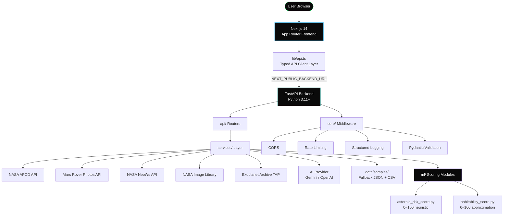

<div align="center">

# 🌌 AstroVision ExoLab AI

### AI-powered astronomy exploration, exoplanet analytics, asteroid intelligence, and 3D solar system visualization.

*A cinematic, full-stack astronomy intelligence platform built on NASA's open APIs — designed for exploration, research, and recruiter impact.*

<br/>

[](https://nextjs.org/)
[](https://www.typescriptlang.org/)
[](https://fastapi.tiangolo.com/)
[](https://www.python.org/)
[](https://threejs.org/)
[](https://api.nasa.gov/)
[](https://tailwindcss.com/)
[](#ai-assistant)
[](./LICENSE)
[](#)

</div>

---

## 📸 Preview

> Add screenshots inside `docs/screenshots/` after deployment.

| | |
|---|---|
|  |  |
| *Cinematic landing page with glassmorphism UI* | *Main intelligence dashboard* |
|  |  |
| *Interactive 3D Solar System (WebGL)* | *Exoplanet discovery and habitability dashboard* |

---

## 🚀 Overview

**AstroVision ExoLab AI** is a cinematic astronomy intelligence platform that integrates NASA's open APIs, exoplanet datasets, near-Earth asteroid tracking, conversational AI explanations, and interactive 3D visualization into a single full-stack web application. Built with a premium dark space-tech aesthetic — glassmorphism cards, scroll-reveal animations, and a grain-overlay UI language — it is designed to be as visually compelling as it is technically rigorous.

The backend is a FastAPI service that owns all API secrets, normalizes every external response into a stable typed contract, and falls back gracefully to curated sample data whenever a live upstream call fails. The frontend is a Next.js 14 App Router application that communicates exclusively with the backend, ensuring no secrets are ever exposed to the browser. Both layers are fully containerized with Docker and deployable in minutes to Vercel + Render/Railway.

This project demonstrates production-grade patterns across the full stack: async Python services with resilience and rate limiting, Pydantic v2 schema validation, a TypeScript API client layer with centralized error handling, React Three Fiber 3D rendering, and custom educational ML scoring for asteroid risk and exoplanet habitability — each score transparently documented as an approximation, not an official NASA assessment.

---

## ✨ Key Features

| Feature | Description | Status |
|---|---|---|
| 🎬 **Cinematic Landing Page** | Hero, glassmorphism, scroll-reveal animations, mission timeline, system status cards | ✅ Live |
| 🔭 **NASA APOD Explorer** | Astronomy Picture of the Day with date picker, HD download, and AI explanation | ✅ Live |
| 🪐 **Mars Rover Gallery** | Browse Curiosity, Perseverance, and Opportunity imagery by sol and camera | ✅ Live |
| 🖼️ **NASA Image Search** | Full-text search across NASA's Image and Video Library | ✅ Live |
| ☄️ **Near-Earth Asteroid Tracker** | Live 7-day NeoWs feed with close-approach data and hazard flags | ✅ Live |
| 📊 **Asteroid Risk Scoring** | Educational heuristic scoring (0–100) by diameter, velocity, and miss distance | ✅ Live |
| 🌍 **Exoplanet Discovery Dashboard** | Table, search, and charts across 5,500+ confirmed exoplanets | ✅ Live |
| 🧬 **Habitability Score** | Multi-factor educational score by radius, mass, orbit, stellar temp, and Teq | ✅ Live |
| 🤖 **AI Astronomy Assistant** | Conversational AI (Gemini / OpenAI) with offline fallback mode | ✅ Live |
| 🌐 **3D Solar System Simulator** | WebGL orrery built with React Three Fiber — interactive, clickable planets | ✅ Live |
| ❤️ **Favorites / Local Storage** | Save and revisit APOD images, rover photos, exoplanets, and asteroids | ✅ Live |
| 🛡️ **Fallback Demo Data** | Every page renders correctly even without API keys or network access | ✅ Live |
| 📄 **Legal & Policy Pages** | Terms, Privacy, License, and Credits — production-ready | ✅ Live |
| 🔐 **Secure Env Handling** | All secrets live on the backend only; never logged, never sent to the browser | ✅ Live |

---

## 🗺️ Pages & Routes

| Route | Purpose |
|---|---|
| `/` | Cinematic landing page — hero, timeline, mission status cards |
| `/dashboard` | Central intelligence dashboard — APOD summary, asteroid alerts, exoplanet stats |
| `/nasa-explorer` | NASA APOD date picker, Mars Rover gallery, and Image Library search |
| `/exoplanets` | Exoplanet discovery table, search, charts, habitability scores, and AI explain |
| `/asteroids` | Near-Earth asteroid NeoWs feed with risk scoring and hazard classification |
| `/solar-system` | Interactive WebGL 3D solar system with planet details and speed control |
| `/assistant` | Conversational AI astronomy assistant with context selection |
| `/terms` | Terms & Conditions |
| `/privacy` | Privacy Policy |
| `/license` | MIT License |
| `/credits` | Credits & Data Sources |

---

## 🛠️ Tech Stack

### Frontend
| Technology | Version | Role |
|---|---|---|
| [Next.js](https://nextjs.org/) | 14 (App Router) | SSR/CSR framework, routing |
| [TypeScript](https://www.typescriptlang.org/) | 5.5 | Type safety across all components |
| [Tailwind CSS](https://tailwindcss.com/) | 3.4 | Utility-first styling with custom design tokens |
| [Framer Motion](https://www.framer.com/motion/) | 11 | Page transitions and cinematic animations |
| [React Three Fiber](https://docs.pmnd.rs/react-three-fiber) | 8 | Declarative Three.js for the 3D solar system |
| [Three.js](https://threejs.org/) | 0.169 | WebGL scene graph and orbital rendering |
| [Recharts](https://recharts.org/) | 2 | Discovery-year and distribution charts |

### Backend
| Technology | Version | Role |
|---|---|---|
| [FastAPI](https://fastapi.tiangolo.com/) | 0.115 | Async REST API with auto-generated OpenAPI docs |
| [Python](https://www.python.org/) | 3.11+ | Core runtime |
| [Pydantic v2](https://docs.pydantic.dev/) | 2.10 | Request/response validation and settings management |
| [HTTPX](https://www.python-httpx.org/) | 0.28 | Async HTTP client for NASA API calls |
| [Pandas](https://pandas.pydata.org/) | 2.2 | Exoplanet TAP CSV ingestion and normalization |
| [NumPy](https://numpy.org/) | 2.1 | Numerical processing in scoring modules |
| [scikit-learn](https://scikit-learn.org/) | 1.6 | Supporting ML utilities |
| [SlowAPI](https://github.com/laurentS/slowapi) | 0.1 | In-memory rate limiting (120 req/60s/IP) |
| [Uvicorn](https://www.uvicorn.org/) | 0.34 | ASGI production server |

### AI & Data Sources
| Source | Data |
|---|---|
| [NASA APOD API](https://api.nasa.gov/#apod) | Astronomy Picture of the Day |
| [NASA Mars Rover Photos API](https://api.nasa.gov/#mars-rover-photos) | Curiosity, Perseverance, Opportunity imagery |
| [NASA NeoWs API](https://api.nasa.gov/#NeoWS) | Near-Earth Object close-approach feed |
| [NASA Image and Video Library](https://images.nasa.gov/docs/images.nasa.gov_api_docs.pdf) | Full-text NASA image search |
| [NASA Exoplanet Archive TAP](https://exoplanetarchive.ipac.caltech.edu/docs/TAP/usingTAP.html) | 5,500+ confirmed exoplanet dataset |
| [Google Gemini API](https://ai.google.dev/) | AI astronomy assistant (optional) |
| [OpenAI API](https://openai.com/api/) | AI astronomy assistant alternative (optional) |

### Deployment
| Target | Tool |
|---|---|
| Frontend | [Vercel](https://vercel.com/) (recommended) |
| Backend | [Render](https://render.com/) (Blueprint included) / [Railway](https://railway.app/) |
| Container | Docker + Docker Compose (full-stack local) |

---

## 🏗️ Architecture



**Key architectural principle:** the frontend communicates *only* with the FastAPI backend. The backend owns all secrets, normalizes every upstream response into a stable typed contract, and sets `"fallback": true` on any response that used sample data. This means no API keys, no raw NASA payloads, and no third-party errors ever reach the browser.

---

## ⚙️ Local Setup

### Prerequisites

- **Node.js** 18+ and **npm** 9+
- **Python** 3.11+
- A free [NASA API key](https://api.nasa.gov/) *(optional — `DEMO_KEY` is used automatically if absent)*
- A [Gemini](https://ai.google.dev/) or [OpenAI](https://openai.com/api/) key *(optional — AI assistant runs in offline fallback mode without one)*

---

### 1. Clone the repository

```bash
git clone https://github.com/YOUR_USERNAME/AstroVision-ExoLab-AI.git
cd AstroVision-ExoLab-AI
```

### 2. Backend setup

```bash
cd backend

# Create and activate a virtual environment
python -m venv .venv
source .venv/bin/activate       # Windows: .venv\Scripts\activate

# Install dependencies
pip install -r requirements.txt

# Configure environment
cp .env.example .env
# Open .env and add your keys (all are optional — see .env.example)
```

**`.env` reference:**

```env
NASA_API_KEY=your_nasa_key_here        # optional; DEMO_KEY used if blank
GEMINI_API_KEY=your_gemini_key_here    # optional; activates AI assistant
OPENAI_API_KEY=your_openai_key_here    # optional; alternative AI provider
FRONTEND_URL=http://localhost:3000
BACKEND_URL=http://localhost:8000
ENVIRONMENT=development
```

```bash
# Start the backend
uvicorn app.main:app --reload --port 8000
```

Interactive API docs available at [`http://localhost:8000/docs`](http://localhost:8000/docs)

---

### 3. Frontend setup

```bash
cd ../frontend

# Configure environment
cp .env.local.example .env.local
# .env.local.example contains: NEXT_PUBLIC_BACKEND_URL=http://localhost:8000

# Install dependencies
npm install

# Start the development server
npm run dev
```

Open [`http://localhost:3000`](http://localhost:3000) to view the application.

---

### 4. Docker Compose (full-stack)

```bash
# From the repository root
docker compose up --build
```

| Service | URL |
|---|---|
| Frontend | `http://localhost:3000` |
| Backend | `http://localhost:8000` |
| API Docs | `http://localhost:8000/docs` |

---

## 🌐 Deployment

### Frontend → Vercel

```bash
# Install Vercel CLI
npm install -g vercel

# Deploy from the frontend directory
cd frontend && vercel --prod
```

Set the environment variable in the Vercel dashboard:
```
NEXT_PUBLIC_BACKEND_URL=https://your-backend-url.onrender.com
```

### Backend → Render (one-click Blueprint)

A `render.yaml` Blueprint is included at the repository root. In the [Render dashboard](https://render.com/):

1. **New → Blueprint → Connect this repository**
2. Set secret environment variables in the Render dashboard:
   - `NASA_API_KEY`
   - `GEMINI_API_KEY` or `OPENAI_API_KEY`
   - `FRONTEND_URL` (your Vercel deployment URL)
   - `CORS_ORIGINS` (same as `FRONTEND_URL`)

The health check endpoint at `/health` confirms live configuration status:

```json
{
  "app": "AstroVision ExoLab AI",
  "version": "1.0.0",
  "nasa_key_configured": true,
  "ai_key_configured": true
}
```

---

## 📡 API Reference

Base URL: `http://localhost:8000` · Interactive docs: [`/docs`](http://localhost:8000/docs) (Swagger) · [`/redoc`](http://localhost:8000/redoc)

> All data responses include a `"fallback": true/false` boolean indicating whether live upstream data or curated sample data was returned. Errors return `{ "detail": "..." }`.

| Method | Endpoint | Description |
|---|---|---|
| `GET` | `/health` | App status + key-configured flags |
| `GET` | `/api/nasa/apod?date=YYYY-MM-DD` | Astronomy Picture of the Day |
| `GET` | `/api/nasa/mars-rover?rover=curiosity&sol=1000&camera=NAVCAM` | Mars rover photos |
| `GET` | `/api/nasa/images/search?q=galaxy` | NASA Image Library full-text search |
| `GET` | `/api/asteroids/upcoming` | NeoWs 7-day feed enriched with risk scores |
| `GET` | `/api/asteroids/risk-score?estimated_diameter_km=…` | Score a single asteroid (0–100) |
| `GET` | `/api/exoplanets/confirmed?limit=100` | Confirmed exoplanets from NASA TAP |
| `GET` | `/api/exoplanets/search?q=kepler&limit=100` | Search exoplanets by name |
| `GET` | `/api/exoplanets/stats` | Aggregate discovery statistics |
| `GET` | `/api/exoplanets/habitability-score?planet_radius_earth=…` | Habitability score (0–100) |
| `POST` | `/api/assistant/chat` | AI astronomy assistant (ai/fallback mode) |
| `GET` | `/api/solar-system/planets` | Full planetary dataset with orbital data |
| `GET/POST/DELETE` | `/api/favorites[/{id}]` | Favorites CRUD |

### Example: Asteroid Risk Score

```bash
curl "http://localhost:8000/api/asteroids/risk-score?estimated_diameter_km=1.2&relative_velocity_kph=85000&miss_distance_km=1500000&is_potentially_hazardous=true"
```

```json
{
  "risk_score": 100,
  "risk_level": "Critical",
  "explanation": "Risk 100/100 (Critical). Very large diameter (~1.20 km): +35; High velocity (~85,000 kph): +25; Very close approach (~1,500,000 km): +30; NASA flags as potentially hazardous: +20. This is an educational heuristic, not an official NASA hazard assessment."
}
```

### Example: Habitability Score

```bash
curl "http://localhost:8000/api/exoplanets/habitability-score?planet_radius_earth=1.1&orbital_period_days=320&stellar_temperature=5600&equilibrium_temperature=275"
```

```json
{
  "habitability_score": 80,
  "category": "Promising",
  "explanation": "Habitability 80/100 (Promising). Earth-like radius (1.1 R_earth): +20; Temperate orbit (320 d): +15; Sun-like star (5600 K): +10; Liquid-water temperature (275 K): +20. This is an educational approximation, not a scientifically validated model.",
  "missing_data_warning": null
}
```

---

## 🔐 Security

- **All API keys are backend-only.** No secret ever touches the frontend or browser.
- Keys are never logged. Query strings containing key material are stripped before log output.
- CORS origins are restricted to `FRONTEND_URL` (and `CORS_ORIGINS` in production).
- All inputs are validated via Pydantic v2 schemas with custom validators (date format, query length, safe float parsing).
- Rate limiting is enforced at 120 requests / 60 seconds per IP via SlowAPI.
- `DEMO_KEY` is used automatically when no NASA key is configured — the app is fully usable without any key.

---

## 📂 Project Structure

```
AstroVision-ExoLab-AI/
├── frontend/                       # Next.js 14 App Router
│   ├── app/
│   │   ├── page.tsx               # Cinematic landing page
│   │   ├── dashboard/             # Intelligence dashboard
│   │   ├── nasa-explorer/         # APOD + Rover + Image search
│   │   ├── exoplanets/            # Exoplanet analytics
│   │   ├── asteroids/             # Asteroid tracker
│   │   ├── solar-system/          # 3D solar system
│   │   └── assistant/             # AI chat
│   ├── components/
│   │   ├── ui/                    # GlassCard, Badges, States
│   │   ├── layout/                # DashboardShell
│   │   ├── three/                 # Orrery, SolarSystemScene
│   │   ├── charts/                # BarChart (dependency-free)
│   │   ├── assistant/             # AIExplain modal
│   │   └── landing/               # HeroBackground, TiltCard
│   └── lib/                       # Typed API client + domain exports
│
├── backend/                        # FastAPI Python service
│   ├── app/
│   │   ├── api/                   # Route handlers (nasa, asteroids, ...)
│   │   ├── services/              # Business logic + fallback handling
│   │   ├── ml/                    # asteroid_risk_score, habitability_score
│   │   ├── schemas/               # Pydantic v2 request/response models
│   │   ├── core/                  # Config, CORS, logging, rate limit, security
│   │   └── utils/                 # api_client, fallback_loader, validators
│   ├── data/samples/              # Curated fallback JSON + CSV
│   └── requirements.txt
│
├── docs/
│   ├── API_DOCS.md
│   ├── TRD.md
│   ├── PRD.md
│   ├── DESIGN_SYSTEM.md
│   └── USER_WORKFLOW.md
│
├── data/samples/                   # Shared fallback data (repo root copy)
├── docker-compose.yml              # Full-stack local container setup
└── render.yaml                     # Render Blueprint for one-click backend deploy
```

---

## 🤖 AI Assistant

The AI assistant (`/assistant`) uses a retrieval-grounded prompt architecture that injects NASA object data as context before generating responses, keeping answers factually grounded rather than speculative.

**Configuration:**

| Mode | Trigger |
|---|---|
| `ai` | `GEMINI_API_KEY` or `OPENAI_API_KEY` is set in `backend/.env` |
| `fallback` | No key configured — intelligent offline responses based on prompt context |

The mode is surfaced to the UI via `"mode": "ai"` or `"mode": "fallback"` in every `/api/assistant/chat` response, so users always know which mode is active.

---

## ⚠️ Disclaimers

- **Asteroid risk scores** are educational heuristics based on diameter, velocity, miss distance, and NASA hazard classification. They are not official NASA Planetary Defense assessments.
- **Habitability scores** are educational approximations based on planetary radius, mass, orbital period, stellar temperature, and equilibrium temperature. They are not scientifically validated models.
- This project is not affiliated with, endorsed by, or sponsored by NASA. Exoplanet data is sourced from the publicly accessible [NASA Exoplanet Archive](https://exoplanetarchive.ipac.caltech.edu/), and imagery is retrieved from [NASA's Open APIs](https://api.nasa.gov/).
- The AI assistant may make errors. It should not be used as a source of scientific fact.

---

## 📄 License

This project is licensed under the **MIT License** — see the [LICENSE](./LICENSE) file for details.

---

## 🔗 Data Sources & Credits

| Source | License |
|---|---|
| [NASA Open APIs](https://api.nasa.gov/) | Public Domain / NASA Open Data |
| [NASA Exoplanet Archive](https://exoplanetarchive.ipac.caltech.edu/) | Public Domain (NASA/Caltech/IPAC) |
| [NASA Image and Video Library](https://images.nasa.gov/) | Public Domain |
| [Iconify Solar icon set](https://icon-sets.iconify.design/solar/) | Apache 2.0 |
| [Unsplash](https://unsplash.com/) | Unsplash License (landing page imagery) |

---

## 💼 For Recruiters & Reviewers

This project was built as a portfolio demonstration of full-stack AI/ML engineering skills. It showcases:

- **Full-stack architecture** — decoupled Next.js frontend and FastAPI backend with strict typed contracts between layers
- **API integration & resilience** — multi-source NASA API integration with async service layer, timeout handling, and automatic fallback to sample data
- **ML/scoring module design** — self-contained, testable, domain-documented scoring functions with transparent output explanations
- **Security best practices** — secrets isolation, input validation, CORS restriction, rate limiting, and no-log key handling
- **Production deployment** — Dockerfile for both services, Docker Compose for local development, Render Blueprint for one-click cloud deploy
- **3D visualization** — React Three Fiber WebGL scene with orbital mechanics, interactive planet selection, and responsive layout
- **TypeScript discipline** — fully typed API client, response schemas, and component props throughout

**Resume bullet:**

> Built *AstroVision ExoLab AI* — a full-stack astronomy intelligence platform integrating 5 NASA APIs, a FastAPI Python backend with educational ML scoring modules (asteroid risk + exoplanet habitability), a Next.js 14 / React Three Fiber frontend with glassmorphism UI, and an AI astronomy assistant (Gemini/OpenAI) with offline fallback mode; deployed via Docker + Vercel + Render.

**LinkedIn caption:**

> 🌌 Just shipped AstroVision ExoLab AI — a full-stack astronomy platform powered by NASA's open APIs. Features: live APOD & Mars Rover imagery, 5,500+ exoplanet analytics with habitability scoring, near-Earth asteroid tracking with risk assessment, a conversational AI astronomy assistant (Gemini/OpenAI), and an interactive 3D Solar System built in React Three Fiber. The backend is a FastAPI Python service with graceful fallback to curated demo data — so every page renders even without API keys. Built with Next.js 14, TypeScript, Tailwind CSS, Framer Motion, and a cinematic dark-space design system. #FullStack #AI #MachineLearning #NASA #Python #React

---

<div align="center">

**Made with 🌠 and a lot of stargazing**

[⬆ Back to top](#-astrovision-exolab-ai)

</div>
